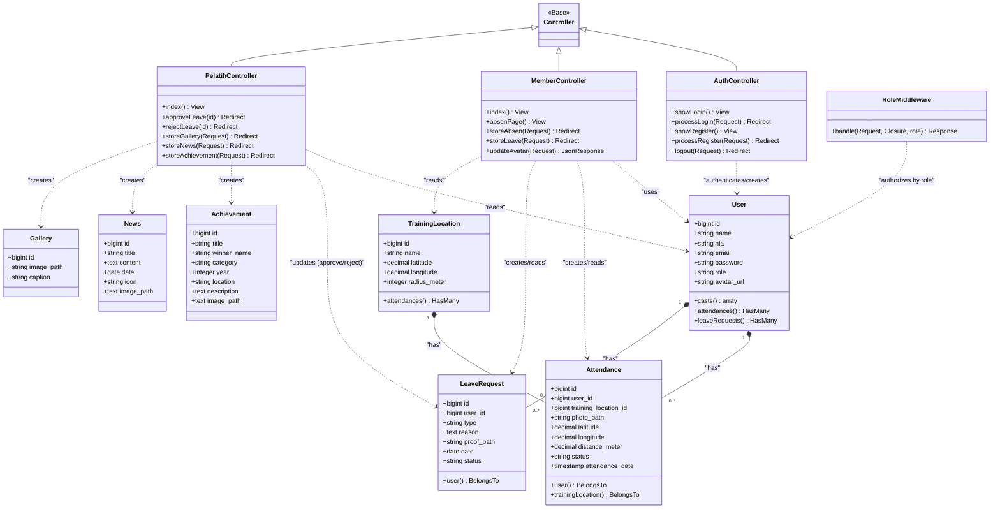

# Class Diagram / Class Relation Diagram (CRD) - Semarang Fencing Club (SFC)

Berikut adalah Class Diagram yang menggambarkan hubungan antar-kelas (Controller, Model, dan Middleware) dalam arsitektur aplikasi Laravel SFC.

## 📊 Class Diagram (Mermaid UML)

---

## 📝 Penjelasan Arsitektur Kelas

Aplikasi ini menggunakan pola arsitektur **MVC (Model-View-Controller)** bawaan Laravel:

### 1. Controllers (Logika Bisnis)
*   **`AuthController`**: Mengatur proses otentikasi pengguna, mulai dari menampilkan form login/registrasi, memvalidasi kredensial pengguna (menggunakan kombinasi NIA & password), hingga menangani proses registrasi anggota baru dan pembuatan nomor NIA secara otomatis.
*   **`MemberController`**: Mengatur interaksi khusus anggota (*member*), seperti menampilkan halaman dashboard member, memproses absensi lokasi latihan (menggunakan GPS & kamera/upload foto), memproses pengajuan izin latihan, serta memproses unggah/potong foto profil (*avatar*).
*   **`PelatihController`**: Mengatur halaman dashboard pelatih/admin. Memiliki fungsi untuk menyetujui atau menolak izin latihan anggota, serta menambahkan konten dinamis seperti berita kejuaraan (`News`), data prestasi medali (`Achievement`), dan foto-foto dokumentasi (`Gallery`).

### 2. Models (Struktur Data & Relasi ORM)
*   **`User`**: Representasi entitas pengguna di sistem. Model ini terhubung ke banyak data presensi (`attendances`) dan perizinan (`leaveRequests`).
*   **`TrainingLocation`**: Representasi titik koordinat lokasi latihan. Terhubung dengan data absensi untuk menentukan apakah absensi dilakukan di lokasi ini.
*   **`Attendance`**: Representasi data absensi latihan anggota. Memiliki relasi timbal balik (`BelongsTo`) ke model `User` dan `TrainingLocation`.
*   **`LeaveRequest`**: Representasi pengajuan izin tidak hadir latihan yang diajukan oleh anggota. Terhubung balik ke model `User`.
*   **`Achievement`**, **`News`**, **`Gallery`**: Model-model mandiri yang menyimpan konten dinamis informasi klub Fencing.

### 3. Middleware (Keamanan & Filter)
*   **`RoleMiddleware`**: Digunakan untuk membatasi akses rute (*routes*) tertentu berdasarkan peran pengguna. Contohnya, memastikan hanya pengguna dengan role `pelatih` yang bisa mengakses modul pengelolaan data berita, galeri, dan verifikasi izin.
