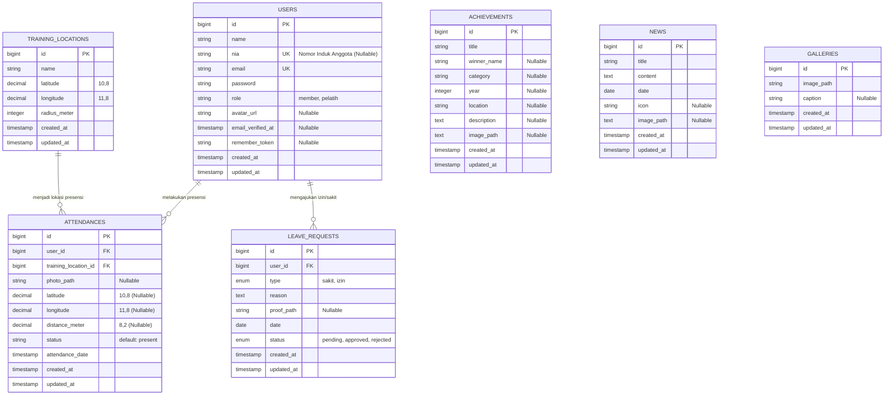

# Entity Relationship Diagram (ERD) - Semarang Fencing Club (SFC)

Berikut adalah Entity Relationship Diagram (ERD) untuk basis data aplikasi Semarang Fencing Club (SFC). Diagram ini memetakan relasi antar entitas utama seperti pengguna (`users`), presensi (`attendances`), lokasi latihan (`training_locations`), pengajuan izin (`leave_requests`), prestasi (`achievements`), berita (`news`), dan galeri (`galleries`).

## 📊 Diagram Relasi (Mermaid ERD)

---

## 📝 Penjelasan Detail Tabel & Kolom

### 1. `users` (Tabel Pengguna)
Menyimpan data akun untuk pelatih dan anggota (member).
*   `id`: Primary key.
*   `name`: Nama lengkap pengguna.
*   `nia`: Nomor Induk Anggota unik (misal: `SFC-001`), null untuk pelatih.
*   `email`: Alamat email unik.
*   `password`: Hash password pengguna.
*   `role`: Hak akses/peran dalam aplikasi (`member` atau `pelatih`).
*   `avatar_url`: Path file foto profil pengguna.

### 2. `training_locations` (Tabel Lokasi Latihan)
Menyimpan data titik pusat lokasi latihan guna validasi geofencing.
*   `id`: Primary key.
*   `name`: Nama lokasi (misal: "Kampung Atas").
*   `latitude` & `longitude`: Titik koordinat pusat lokasi.
*   `radius_meter`: Jarak jangkauan maksimal yang diizinkan untuk absensi.

### 3. `attendances` (Tabel Presensi)
Menyimpan riwayat absensi kehadiran latihan para anggota.
*   `id`: Primary key.
*   `user_id`: Relasi ke tabel `users` (siapa yang absen).
*   `training_location_id`: Relasi ke tabel `training_locations` (absen untuk lokasi mana).
*   `photo_path`: Path berkas foto selfie sebagai bukti kehadiran.
*   `latitude` & `longitude`: Titik koordinat saat anggota melakukan absen.
*   `distance_meter`: Jarak (dalam meter) antara posisi anggota dengan titik pusat latihan.
*   `status`: Status kehadiran (default: `present`).
*   `attendance_date`: Tanggal dan waktu presensi.

### 5. `leave_requests` (Tabel Pengajuan Izin/Sakit)
Menyimpan riwayat dan status perizinan anggota yang berhalangan hadir.
*   `id`: Primary key.
*   `user_id`: Relasi ke tabel `users` (siapa yang mengajukan).
*   `type`: Tipe izin (`sakit` atau `izin`).
*   `reason`: Alasan detail tidak menghadiri latihan.
*   `proof_path`: Path file foto bukti (seperti surat dokter atau surat izin orang tua).
*   `date`: Tanggal berhalangan hadir.
*   `status`: Status persetujuan dari pelatih (`pending`, `approved`, `rejected`).

### 6. `achievements` (Tabel Prestasi)
Menyimpan riwayat peraihan medali atau kejuaraan klub maupun individu.
*   `title`: Nama kejuaraan/medali (misal: "Medali Emas Kejurnas Fencing").
*   `winner_name`: Nama pemenang/anggota yang meraih prestasi.
*   `category`: Kategori pertandingan (misal: "Degen Kadet Putra").
*   `year`: Tahun pencapaian.
*   `location`: Tempat diadakannya kompetisi.
*   `image_path`: Path kumpulan foto dokumentasi prestasi.

### 7. `news` (Tabel Berita)
Menyimpan artikel informasi atau kabar terbaru klub.
*   `title`: Judul berita.
*   `content`: Isi berita lengkap.
*   `date`: Tanggal terbit berita.
*   `icon`: Emoji ikon representasi berita.
*   `image_path`: Path kumpulan foto dokumentasi berita.

### 8. `galleries` (Tabel Galeri)
Menyimpan foto-foto dokumentasi umum klub.
*   `image_path`: Path file gambar di penyimpanan server.
*   `caption`: Keterangan singkat foto.
